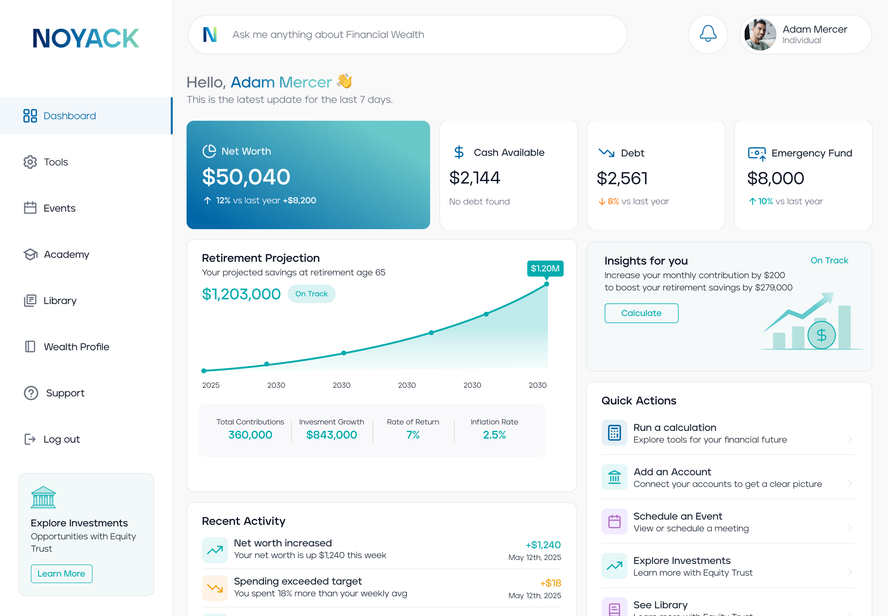

# Noyack Investor Dashboard

A modern investor portal designed to help members track their financial health, discover educational resources, attend exclusive events, and make informed financial decisions through interactive planning tools.

## Overview

The Noyack Investor Dashboard provides a centralized experience for investors to manage their financial journey. The platform combines portfolio insights, wealth profiling, educational content, event management, and financial planning into a single intuitive interface.

## Features

### Dashboard Overview

* Personalized investor dashboard
* Financial health metrics
* Activity tracking
* Quick access to key resources

### Wealth Profile

* Profile completion tracking
* Wealth IQ assessment
* Financial insights and recommendations
* Household and financial information management

### Events

* Featured investor events
* Event discovery and registration
* Category filtering
* Speaker and attendee information

### Financial Planning Tools

* Rent vs Buy calculator
* Cost comparison modeling
* Scenario planning
* Interactive financial visualizations

### Resource Library

* Educational content hub
* Search and filtering
* Curated investor resources
* Personalized recommendations

## Design System

The interface is built using a custom design system featuring:

* Consistent typography scale
* Reusable component architecture
* Brand token system
* Responsive layouts
* Accessible interaction patterns
* Blue and teal financial branding

## Tech Stack

* React
* TypeScript
* Vite
* Recharts
* Lucide React
* CSS

## Screenshots

### Dashboard Overview



### Tools


### Events


### Financial Planning


### Resource Library


## Installation

```bash
npm install
npm run dev
```

## Author

Benjamin Araica
